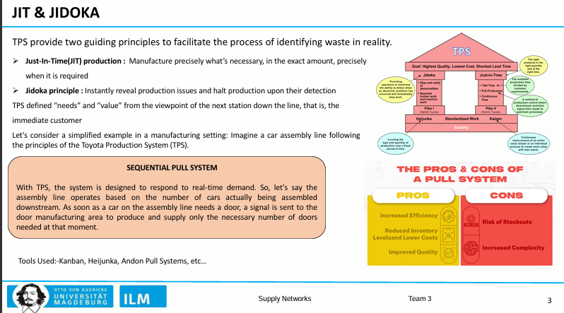
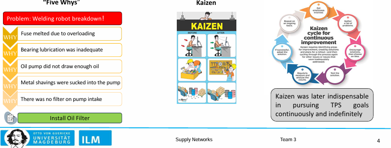
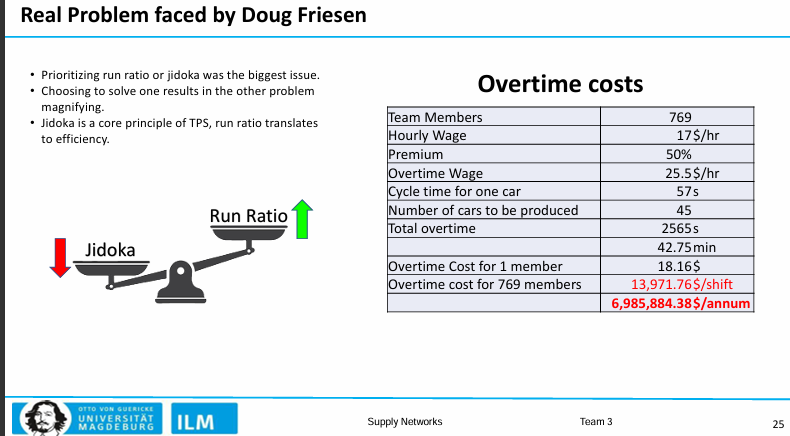

# 🚚 Supply Networks – Toyota Motor Manufacturing, U.S.A., Inc.

---

## ⭐ STAR Summary

- **Situation:** Toyota faced defective seat installation issues at Toyota Motor Manufacturing, Kentucky, affecting throughput and quality.  
- **Task:** Analyze supply network processes to identify root causes, ensure efficient coordination, and propose corrective actions.  
- **Action:**  
  - Applied **5 Whys method** to trace root causes of production bottlenecks.  
  - Modeled **Sequential Pull System** to visualize lean material flow.  
  - Conducted **Overtime Cost Analysis** to quantify operational inefficiencies.  
- **Result:** Identified systemic supplier and coordination issues, proposed corrective strategies, and validated efficiency improvements — leading to improved reliability and reduced costs.  

---

## 🔑 Highlights

- ✅ Case study on **Toyota’s supply network & lean management**.  
- ✅ Practical application of **root cause analysis (5 Whys)**.  
- ✅ Demonstrated **lean material handling** via pull systems.  
- ✅ Quantified the **impact of inefficiencies** using cost analysis.  
- ✅ Delivered actionable strategies for **supplier collaboration & system resilience**.  

---

## 📊 Key Figures

### 1. Sequential Pull System  
  
*Visual representation of Toyota’s lean pull-based material handling.*  

---

### 2. Root Cause Analysis – 5 Whys  
  
*Tracing production defects back to supplier coordination issues using the 5 Whys method.*  

---

### 3. Overtime Cost Analysis  
  
*Financial impact of inefficiencies quantified through overtime cost analysis.*  

---

## 📑 Reports

- [📥 Supply Networks Summary Report (PDF)](docs/reports/SN_WS23-24_Kanikyaswamy_SummaryReport.pdf)  
- [📥 Toyota Case Study Presentation (PDF)](docs/reports/Presentation_WS23-24_ToyotaCase.pdf)  

---

## 📂 Repository Structure

